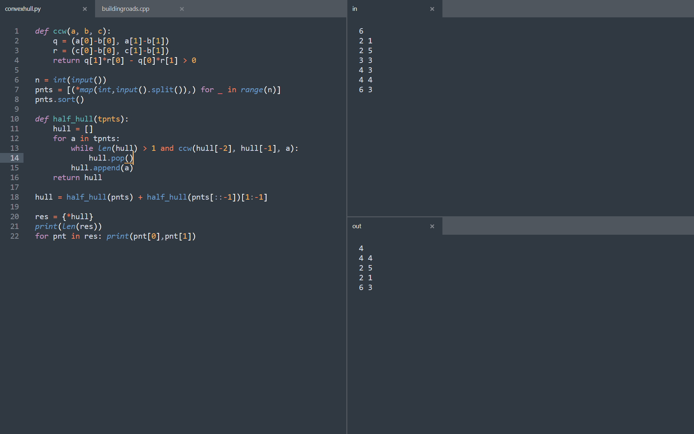

# starfihs-sublime-config

# Plugins
- Package Control
- Remember Minimap Setting
- Terminus
- Toggle the View Read-Only
- View in Browser

# Key Bindings
| Key             | Action                 |
| --------------- | ---------------------- |
| Ctrl+(Shift)+o  | Open file/directory    |
| Ctrl+s          | Save                   |
| Ctrl+r          | Run+save               |
| Ctrl+xcv        | Copy/paste             |
| Ctrl+[]         | Indent                 |
| Ctrl+(Shift)+/  | Comment                |
| Ctrl+hfp        | Popup stuff            |
| Ctrl+(Shift)+nw | Add/remove tab/window  |
| Ctrl+123        | Move to panel          |
| Alt+123         | Move to tab            |
| Ctrl+Shift+123  | Move to panel with tab |
| Ctrl+Alt+123    | Toggle stuff           |
| Ctrl+Alt+v      | View in browser        |

# TODO
- Ctrl+r automatically selects user build
- Run refreshes output
- User builds for c++, java, etc
- Open folders with layout #6 and in/out files
- Change layout on window resize (all in a single column for splitscreen)
- Keybind to paste cpp / python templates
- Customize titlebar text (not currently possible)
